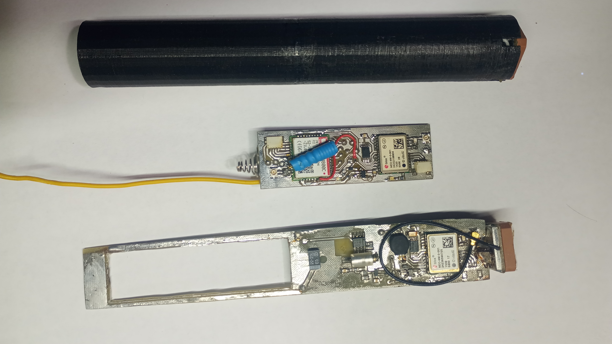
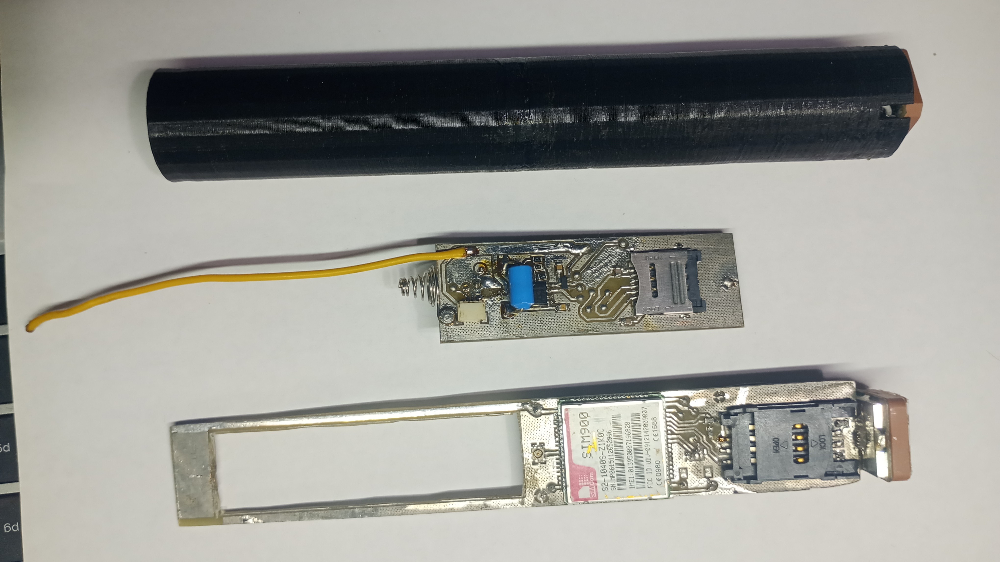
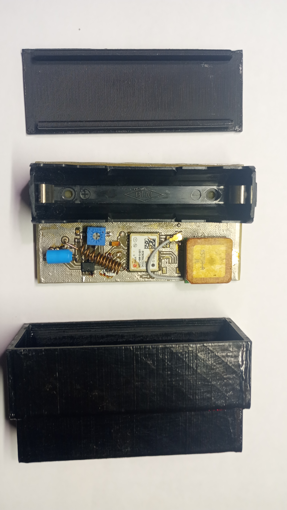
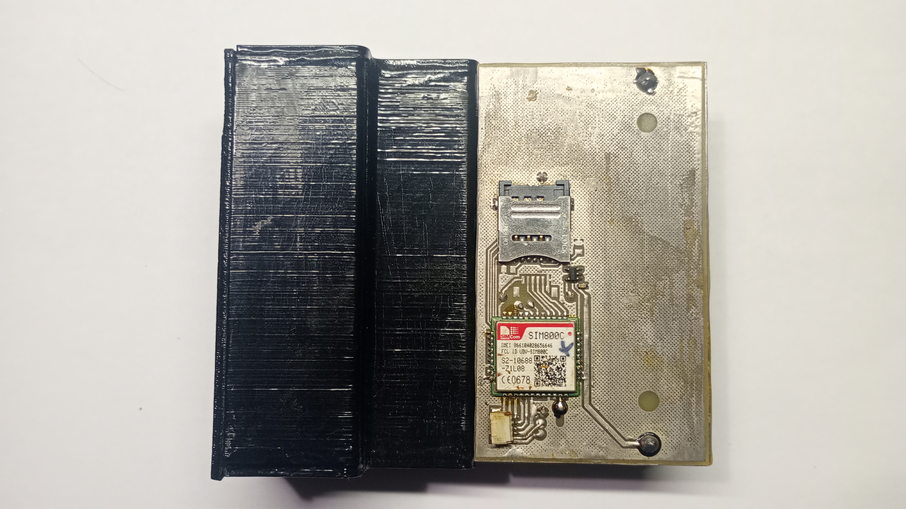

# GPS Location Tracker #

## Опис проекту ##

Цей проект представляє собою пристрій для визначення місця розташування на основі GPS технології. Пристрій здатен отримувати координати з супутників GPS i передавати дані на сервер для подальшої обробки або відображення. Основою пристрою є GSM система стільникового звязку, тому для його роботи необхідно вставити SIM-карту з достатньою кількістю коштів або необхідних послуг. Управління пристроєм відбувається через дзвінок на номер SIM-карти дотримуючись інструкцій з допомогою тонального набору (DTMF) або відправиши SMS з потрібною командою.

 ### Функціональні можливості ###
- Визначення географічних координат.
- Відправка координат через SMS.
- Передача координат на сервер через інтернет.
- Зберігання координат у локальній пам'яті пристрою.
- Стеження активується за допомогює датчика вібрації

 ### Складові проекту ###
#### Апаратура ####

- GPS модуль (Neo-6M)
- GSM модуть (Sim800c)
- BT модуль (HM-10)
- Джерело живлення (акумулятор 18650)

#### Програмне забезпечення ####

- GsmDeviceTestApp - тестова програма для запуску і перевірки АТ команд на пристрої
- mobile_xamarin_app - мобільний застосунок для пристрою з модулем BT
- TrackerSystemSite - Web-сервер для отриманння координат і відображення маршрутів стеження
